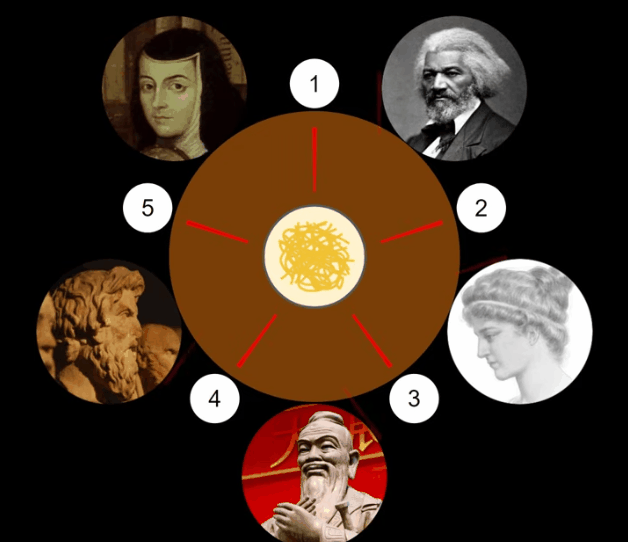

<h1 align="center">
	📖 Philosophers
</h1>

	<b><i>This project is an implementation of the classic "Dining Philosophers" problem.</i></b> 

    
    
    
    
    
    

## Table of Content

## The Dining Philosophers problem
### Overview

This project is an implementation of the classic "Dining Philosophers" problem, where a group of philosophers are sitting around a table and are each trying to eat a bowl of rice using chopsticks. The goal of the project is to ensure that no philosopher starves and that there is no deadlock.

The project consists of two parts: the mandatory part and the bonus part. The mandatory part focuses on the basic implementation of threading and mutexes, while the bonus part includes additional features and optimization.

#### Skills Gained

- Thread creation and management
- Mutex usage for synchronization
- Concurrent programming
- Problem-solving

#### Technologies Used

- C programming language
- pthread library

#### Concepts Learned

- Dining Philosophers problem
- Deadlock and starvation avoidance
- Thread synchronization

## The Subject

In this project, you will learn the basics of threading a process.
You will see how to create threads and you will discover mutexes. `Version: 10`. 
You can read the subject: [`philosophers.subject.pdf`](subject/philo.subject.pdf)

### Overview

Here are the things you need to know if you want to succeed this assignment:
* One or more philosophers sit at a round table. There is a large bowl of spaghetti in the middle of the table.
* The philosophers alternatively __eat__, __think__, or __sleep__. While they are eating, they are not thinking nor sleeping; while thinking, they are not eating nor sleeping; and, of course, while sleeping, they are not eating nor thinking.
* There are also forks on the table. There are as many forks as philosophers.
* Because serving and eating spaghetti with only one fork is very inconvenient, a philosopher takes their right and their left forks to eat, one in each hand.
* When a philosopher has finished eating, they put their forks back on the table and start sleeping. Once awake, they start thinking again. The simulation stops when a philosopher dies of starvation.
* Every philosopher needs to eat and should never starve.
* Philosophers don’t speak with each other.
* Philosophers don’t know if another philosopher is about to die.
* No need to say that philosophers should avoid dying!

#### Global rules

* You have to write a program for the mandatory part and another one for the bonus part (if you decide to do the bonus part). They both have to comply with the following rules:

• Global variables are forbidden!
• Your(s) program(s) should take the following arguments: number_of_philosophers - time_to_die - time_to_eat - time_to_sleep   [number_of_times_each_philosopher_must_eat]
    * number_of_philosophers: The number of philosophers and also the number of forks.
    * The vertical position corresponds to its ordinate.
    * The value corresponds to its altitude.
• Each philosopher has a number ranging from 1 to number_of_philosophers.
• Philosopher number 1 sits next to philosopher number number_of_philosophers. Any other philosopher number N sits between philosopher number N - 1 and philosopher number N + 1.

#### About the logs

• Any state change of a philosopher must be formatted as follows:
    * timestamp_in_ms X has taken a fork
    * timestamp_in_ms X is eating
    * timestamp_in_ms X is sleeping
    * timestamp_in_ms X is thinking
    * timestamp_in_ms X died
Replace timestamp_in_ms with the current timestamp in milliseconds and X with the philosopher number.
• A displayed state message should not be mixed up with another message.
• A message announcing a philosopher died should be displayed no more than 10 ms after the actual death of the philosopher.
• Again, philosophers should avoid dying!

#### Mandatory part

Program name        | philo
---------------     | ----------------------------
Turn in files       |Makefile, *.h, *.c, in directory philo/
Makefile            | NAME, all, clean, fclean, re
Arguments           | number_of_philosophers time_to_die time_to_eat time_to_sleep [number_of_times_each_philosopher_must_eat]
External functs.    | • memset, printf, malloc, free, write   • usleep, gettimeofday, pthread_create   • pthread_detach, pthread_join, pthread_mutex_init   • pthread_mutex_destroy, pthread_mutex_lock,   • pthread_mutex_unlock
Libft authorized    | No
Description         | Philosophers with threads and mutexes

The specific rules for the mandatory part are:

* Each philosopher should be a thread.
* There is one fork between each pair of philosophers. Therefore, if there are several philosophers, each philosopher has a fork on their left side and a fork on their right side. If there is only one philosopher, there should be only one fork on the table.
* To prevent philosophers from duplicating forks, you should protect the forks state with a mutex for each of them.

#### Bonus part

Program name        | philo_bonus
---------------     | ----------------------------
Turn in files       |Makefile, *.h, *.c, in directory philo/
Makefile            | NAME, all, clean, fclean, re
Arguments           | number_of_philosophers time_to_die time_to_eat time_to_sleep [number_of_times_each_philosopher_must_eat]
External functs.    | • memset, printf, malloc, free, write,  fork, kill, exit   •  pthread_create, pthread_detach, pthread_join   • usleep, gettimeofday, waitpid, sem_open, sem_close   • sem_post, sem_wait, sem_unlink
Libft authorized    | No
Description         | Philosophers with processes and semaphores

The program of the bonus part takes the same arguments as the mandatory program.
It has to comply with the requirements of the Global rules chapter.

The specific rules for the mandatory part are:

* All the forks are put in the middle of the table.
* They have no states in memory but the number of available forks is represented by a semaphore.
* Each philosopher should be a process. But the main process should not be a philosopher.
